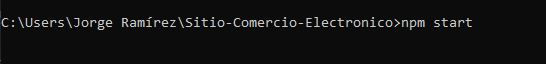
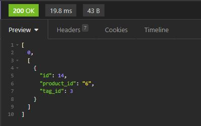

# Sitio de Comercio Electrónico

# Descripción de la aplicación  

* Esta aplicación consiste en una API funcional de Express.js que funciona como back end para un sitio web de comercio electrónico.
* Asimismo, esta aplicación se conecta a una base de datos MySQL usando Sequelize. 
* La aplicación incluye:
    * Rutas GET para traer todas las categorías, todos los productos o todas las etiquetas de la base de datos. Los datos de cada una de estas rutas se muestran en formato JSON.
    * Rutas GET para traer una sola categoría, un solo producto o una sola etiqueta de la base de datos, utilizando el "id" de cada uno. Los datos de cada una de estas rutas se muestran en formato JSON.
    * Rutas POST para crear una categoría, un producto o una etiqueta en la base de datos.
    * Rutas PUT para actualizar/modificar una categoría, un producto o una etiqueta en la base de datos, utilizando el "id" de cada uno.
    * Rutas DELETE para borrar una categoría, un producto o una etiqueta en la base de datos, utilizando el "id" de cada uno.
* Los modelos de la base de datos, cumplen con las siguientes asociaciones:
    + Un producto pertenece a una sola categoría.
    + Una categoría puede tener muchos productos.
    + Un producto puede tener muchas etiquetas.
    + Una etiqueta puede tener muchos productos.

## Esquema de la base de datos

 * El esquema está conformado por cuatro tablas que pertenecen a la base de datos "ecommerce_db".
 * Como se puede observar la tabla "product_tag" sirve para vincular/asociar las tablas "product" y "tag".
 * La creación de la base de datos puede hacerse usando el archivo "schema.sql" ubicado en la carpeta "/db".
 * Igualmente, al ejecutar el comando "npm run seed" desde la terminal de node.js (estando en la carpeta principal/raíz), se pueden crear algunos registros iniciales en las tablas de la base de datos.

## Instrucciones de instalación  

* Esta aplicación requiere de:
    * Instalación de node JS versión 16.18.0
    * Instalación del paquete express 4.17.1
    * Instalación del paquete sequelize 5.21.7
    * Instalación del paquete npm mysql2 2.1.0
    * Instalación del paquete npm dotenv 8.2.0

## Instrucciones para realizar pruebas 

* Emplea el archivo "schema.sql" ubicado en la carpeta "/db" para crear la base de datos. Para ello puedes utilizar MySQL shell directamente, tal como se muestra en la siguiente imagen.
* Es necesario crear un archivo de variable de entorno ".env" en la carpeta principal/raíz de la aplicación, donde coloques el nombre de la base de datos (utilizando la variable "DB_NAME"), el nombre de usuario MySQL (utilizando la variable "DB_USER") y la contraseña necesaria (utilizando la variable "DB_PASS") para acceder a la base de datos.
* La ejecución de la aplicación se tiene que hacer desde la terminal de node.js
* Asegúrate de estar en la ubicación de la carpeta principal/raíz de la aplicación: SITIO-COMERCIO-ELECTRONICO\    
  
* Para crear algunos registros iniciales en las tablas de la base de datos, puedes ejecutar el comando "npm run seed"  
  
* Para iniciar el servidor y poder utilizar las rutas, emplea el comando "npm start" desde la terminal de node.js    
  
* A partir de este punto puedes emplear la dirección http://localhost:3001/ para probar las diferentes rutas y hacer las respectivas consultas a la base de datos. Para ello puedes utilizar algún programa como Insomnia.    
  

## Información de uso de la aplicación

* Una vez que hayas iniciado el servidor mediante el comando "npm start" desde la terminal de node.js y utilizando algún programa/plataforma como Insomnia:

  * Para traer/mostrar todas las categorías contenidas en la base de datos utiliza la siguiente ruta GET:  
    
    * Si la consulta es exitosa, verás la siguiente respuesta:  
      
  * Para traer/mostrar todos los productos contenidos en la base de datos utiliza la siguiente ruta GET:  
    
    * Si la consulta es exitosa, verás la siguiente respuesta:  
      
  * Para traer/mostrar todas las etiquetas contenidas en la base de datos utiliza la siguiente ruta GET:  
    
    * Si la consulta es exitosa, verás la siguiente respuesta:  
      
  * Para traer una sola categoría de la base de datos, utiliza la siguiente ruta GET empleando el "id" de la categoría que deseas traer:  
    
    * Si la consulta es exitosa, verás la siguiente respuesta:  
      
  * Para traer un solo producto de la base de datos, utiliza la siguiente ruta GET empleando el "id" del producto que deseas traer:  
    
    * Si la consulta es exitosa, verás la siguiente respuesta:  
      
  * Para traer una sola etiqueta de la base de datos, utiliza la siguiente ruta GET empleando el "id" de la etiqueta que deseas traer:  
    
    * Si la consulta es exitosa, verás la siguiente respuesta:  
      
  * Para crear una categoría en la base de datos, utiliza la siguiente ruta POST y construye el cuerpo de la solicitud en formato JSON con el nombre de la categoría:  
    
    * Si la creación es exitosa, verás la siguiente respuesta:  
      
  * Para crear un producto en la base de datos, utiliza la siguiente ruta POST y construye el siguiente cuerpo de la solicitud en formato JSON tal como se muestra (las etiquetas para el producto deben ir como un arreglo de números):  
    
     * Si la creación es exitosa, verás la siguiente respuesta:  
      
  * Para crear una etiqueta en la base de datos, utiliza la siguiente ruta POST y construye el cuerpo de la solicitud en formato JSON con el nombre de la etiqueta:  
    
     * Si la creación es exitosa, verás la siguiente respuesta:  
      
  * Para actualizar una categoría en la base de datos, utiliza la siguiente ruta PUT empleando el "id" de la categoría y construye el cuerpo de la solicitud en formato JSON con el nuevo nombre de la categoría:    
    
    * Si la actualización es exitosa, verás la siguiente respuesta:   
     
  * Para actualizar un producto en la base de datos, utiliza la siguiente ruta PUT empleando el "id" del producto y construye el siguiente cuerpo de la solicitud en formato JSON con la nueva información, tal como se muestra (las etiquetas para el producto deben ir como un arreglo de números):  
    
    * Si la actualización es exitosa, verás la siguiente respuesta:  
      
  * Para actualizar una etiqueta en la base de datos, utiliza la siguiente ruta PUT empleando el "id" de la etiqueta y construye el cuerpo de la solicitud en formato JSON con el nuevo nombre de la etiqueta:  
    
    * Si la actualización es exitosa, verás la siguiente respuesta:  
      
  * Para eliminar una categoría de la base de datos, utiliza la siguiente ruta DELETE empleando el "id" de la categoría que deseas eliminar:  
    
    * Si la eliminación es exitosa, verás la siguiente respuesta:   
       
  * Para eliminar un producto de la base de datos, utiliza la siguiente ruta DELETE empleando el "id" del producto que deseas eliminar:  
    
    * Si la eliminación es exitosa, verás la siguiente respuesta:  
      
  * Para eliminar una etiqueta de la base de datos, utiliza la siguiente ruta DELETE empleando el "id" de la etiqueta que deseas eliminar: 
     
    * Si la eliminación es exitosa, verás la siguiente respuesta:  
      

## Enlace a video de funcionalidad de la aplicación

* [Link a video de aplicación]()
